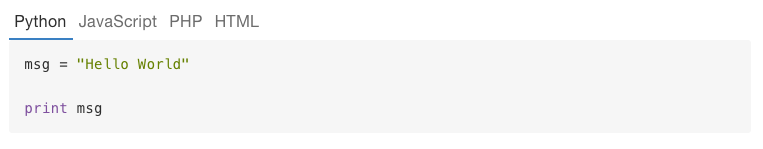

# gitbook-plugin-melchior
Multi-language code block includes for your Gitbook (or other Nunjucks-powered project)! Thanks much to [SamyPesse and the Gitbook team](https://github.com/GitbookIO) for the [idea](https://github.com/GitbookIO/plugin-codetabs), preview image and front-end code.



## Installation
Adds the plugin to your `book.json`, then run `gitbook install` if you are building your book locally.

```js
{
  "plugins": [ "melchior" ]
}
```

## Usage
Three ways to use the plugin. Usage depends on how much you want to configure the order of languages / label, and if you're using GitBook or not.

- create a directory in the root of your book directory called `_includes`
- put your includes somewhere in that folder
- provide a name for your include, in any number of languages
- pipe the name through `melchior`, and voila!

```
my-wonderful-book
├─ book.json
└─ _includes
   └─ hello
      ├─ world.html
      ├─ world.js
      └─ world.py
```

### Lazy Mode
You can autofetch all files matching the given name&hellip;
```md
This is a code block with tabs for each language:

{{ 'hello/world' | melchior }}
```

### Less-Lazy Mode
&hellip;or you can order and filter tabs by passing in language names.

```md
This is a code block with tabs for each language:

{{ 'hello/world' | melchior('Python', 'JavaScript', 'HTML') }}
```

### Wild-West Mode
If you don't want to use Gitbook, an off-label use of this module includes its use (specifically, use of the `melchior` export of `index.js`) as a perfectly normal function, passing in the base directory for your includes.

When used as a standalone function, I happen to prefer an array for the second arg, so that's also an option. Either way you'll get the same output. You can also just not pass anything after the include name and it'll continue to work in Lazy Mode.

```javascript
const gpm = require('gitbook-plugin-melchior');
const render = require('nunjucks').renderString;
const melchior = gpm.melchior(__dirname);

const str1 = `{{ melchior('hello/world', 'Python', 'JavaScript') }}`;
const str2 = `{{ melchior('hello/world', [ 'Python', 'JavaScript' ]) }}`;
const str3 = `{{ melchior('hello/world') }}`;

const res1 = render(str1, { melchior });
const res2 = render(str2, { melchior });
const res3 = render(str3, { melchior });

console.log(res1 === res2); // true, but no such guarantee for res3.
```

## Issues
- uses synchronous `fs` methods everywhere. Sorry, not sorry.
- for modes other than Wild-West Mode, this wildly abuses the idea of a filter. I would've made a function, but you can't easily add things to the rendering `ctx` with Gitbook.
- uses fancy ES6 features, won't work in &lt;6.x versions of Node. May provide a transpiled version if this turns out to be an issue.

## License
Apache 2.0.